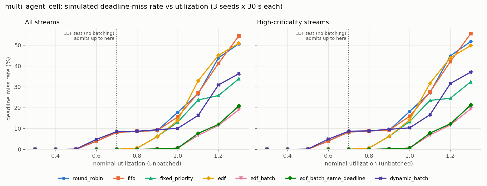
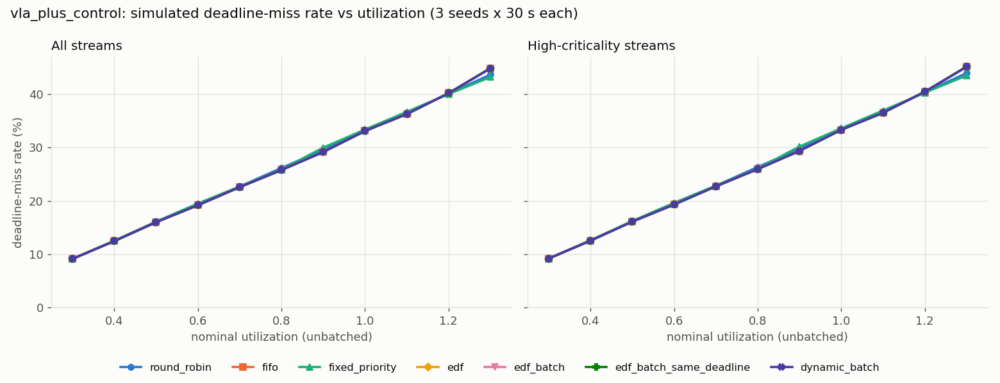

# edgesched

Deadline-aware inference scheduling for several models sharing one edge accelerator.

`edgesched` is a small Python library with three parts that share one set of
policy objects: an admission test that says whether a set of model streams can
meet its deadlines on one non-preemptive executor, a discrete-event simulator to
see what happens when it cannot, and an in-process runtime (`Arbiter`) that
applies the same policy to real requests. It has been run in simulation, on CPU
with PyTorch, and on a desktop RTX 4080 with PyTorch and TensorRT backends. It
has **not** been run on a Jetson; see
[What this does not show yet](#what-this-does-not-show-yet).

## Problem

A robot, or a cell of robots, runs several models per control tick: a perception
CNN, one policy per agent, a planner, maybe a vision-language model. On a Jetson
they all contend for one GPU. The common implementation is a thread or process
per model, each calling its engine directly, with the GPU driver deciding the
order. Nothing in that stack knows that an actor policy must answer within 20 ms
while the planner can wait 200 ms, so under load the wrong request waits.

Existing tools cover the two ends. Triton's dynamic batcher is built for
datacenter throughput: it groups requests per model after a queue delay and
ignores deadlines. Bare TensorRT gives you one engine and one loop. The gap is a
scheduler that owns the device, knows each stream's period and deadline, decides
what runs next, and batches only when batching does not cost a deadline.

The baseline this project measures against is the structure of the author's
earlier autonomy stack (UTASR): camera, TensorRT segmentation, SLAM and control
as workers polled in a `while not stopped: step()` loop, with timestamped
shared-memory buffers but no deadlines and no GPU arbitration. In `edgesched`
that is `RoundRobin` (in simulation) and `DirectLockExecutor` (at runtime).

## Approach

**Model.** A `ModelSpec` has a latency profile `C(b)` (a function of batch size),
a `max_batch`, and a `batchable` flag. A `TaskSpec` (stream) has a model, period,
relative deadline, phase, release jitter, criticality, and an optional `group`
for streams released by one shared tick (for example, MAPPO actors stepped by one
environment step). Each request is a `Job` with release time, absolute deadline,
and start/finish timestamps.

**Non-preemptive execution.** The executor runs one batch at a time to
completion. Preemption is out of scope on purpose: a TensorRT engine or cuDNN
kernel cannot be interrupted once enqueued, so on a real accelerator the only
lever is what runs next. Every analysis and policy here respects that.

**Policies** implement `choose(ready_queue, now, device_state) -> Dispatch | Wait`
and never touch clocks, threads or backends. The simulator and the runtime call
the same objects.

| policy | ordering | batching |
|---|---|---|
| `round_robin` | cycle through streams (polling-loop baseline) | no |
| `fifo` | earliest release | no |
| `fixed_priority` | fixed priority, rate-monotonic by default | no |
| `edf` | earliest absolute deadline | no |
| `edf_batch` | earliest deadline | cross-deadline, guarded (rule RB) |
| `edf_batch_same_deadline` | earliest deadline | one group release only (rule RA) |
| `dynamic_batch` | oldest request among models ready to fire | Triton-style: preferred sizes or max queue delay |

**EDFBatch, rule RB (default).** Let `h` be the earliest-deadline job and `m` its
model; `h` always runs. Let `K` be the `lookahead` earliest-deadline ready jobs of
other models, assumed to run next one at a time. Same-model jobs are considered in
deadline order, and job `c` joins a batch of size `n` only if, with
`f = now + C_m(n+1)`:

1. `c` is predicted to finish by its own deadline (`f <= d_c`);
2. no job already in the batch that met its deadline at size `n` would miss at `n+1`;
3. no job in `K` that meets its deadline when `h` runs alone would miss after the batch.

Growth stops at `max_batch` or at the first violation of (2) or (3). Under the
latency predictions this never turns a predicted hit for `h` or a lookahead job
into a miss (property-tested on random queues). That guard is local. It is not a
schedulability guarantee, because jobs beyond the lookahead or released during
the batch can still be delayed by the riders. The admission test charges for that
explicitly (below).

**EDFBatch, rule RA.** Only jobs from the head's declared group, with the same
release tick and the same absolute deadline, are batched, and batches are
maximal. It batches less often than rule RB, but its admission test accepts more
task sets because a group release is charged as one batch.

**Admission control** (`edgesched.analysis`, `edgesched analyze`). For EDF on one
non-preemptive executor, with constrained deadlines `D_i <= T_i` and jitter
folded in as `D_i - J_i`, a task set is admitted if the charged utilization
`U < 1` and at every absolute deadline `t` up to a bound `L`:

```
dbf(t) + B(t) + R <= t
dbf(t) = sum_i max(0, floor((t - D_i)/T_i) + 1) * W_i
B(t)   = max { blocking_j : D_j > t }
```

This is the non-preemptive EDF demand-bound condition (Jeffay, Stanat and Martel,
RTSS 1991; George, Rivierre and Spuri, INRIA RR-2966, 1996), with `C_j` instead of
`C_j - 1` in the blocking term because time is continuous. The batching rule sets
the terms:

| `batching=` | certifies | per-release demand `W` | blocking | rider term `R` |
|---|---|---|---|---|
| `none` | `edf` | `C(1)` per stream | `C(1)` | 0 |
| `same_deadline` | `edf_batch_same_deadline` | per group: `floor(n/B) C(B) + C(n mod B)` | `C(min(n, B))` | 0 |
| `cross_deadline` | `edf_batch` | `C(1)` per stream | `C(min(B, N_m))` | `sum over streams on shared batchable models of delta_m` |

`delta_m = max_b [C_m(b) - C_m(b-1)]` is the cost of adding one job to a batch,
and the cross-deadline test also requires `delta_m <= C_m(1)`.

An earlier version of this module charged cross-deadline batches only as
blocking, with no `R`. That is unsound, and the test suite now includes the
counterexample. Take `C_m(1) = 1`, `C_m(2) = 1 + c`, a stream Y (C=5, T=D=100),
streams A and B on `m` (T=D=10 and T=D=20), and X1, X2 (C=2, T=D=10). The
blocking-only check holds at `t = 10` (5 + 5 <= 10). With Y released at 0, A and B
at eps, and X1 and X2 at 2 eps, `edf_batch` (lookahead 0 or 1) runs {A, B} at
t = 5 and X2 finishes at 10 + c. The simulator reproduces the miss, and the
current test rejects the set because `R = 2c`. The RA/RB conditions come from a
working paper that accompanies this project (in preparation, proof sketches only).
The suite also simulates every random task set that any rule admits (160 random
sets per run) and asserts zero misses.

The test works from predicted latencies, so it is only as good as the profile.
On a device, profile a high percentile, not the median. It certifies EDF-family
policies only; it says nothing about FIFO, round-robin, fixed priority or the
Triton-style batcher.

**Simulator** (`edgesched.sim`). An event loop over pre-generated, time-sorted
releases (periodic or sporadic, with jitter), one non-preemptive executor, and a
lognormal execution-time noise model with an optional heavy tail. Late jobs are
either dropped once their deadline passes (`drop`) or run anyway (`run`). Runs are
deterministic for a given seed, and every policy sees the same arrivals. Simulating
60 s of `synthetic_mix` (10 streams, 15,625 jobs) with `edf_batch` takes 1.2-1.5 s
wall time, including interpreter start-up
(`time edgesched simulate workloads/synthetic_mix.yaml -p edf_batch --duration 60`,
3 runs at load average 25 on 8 cores).

**Runtime** (`edgesched.runtime`). `Arbiter` owns the device. Producer threads
call `submit(stream, x)` (returns a `concurrent.futures.Future`) or `infer(...)`
(blocks). One dispatcher thread holds the queue, asks the policy, and runs the
chosen batch on the model's backend: it collates inputs, runs, and splits outputs
back to the futures. It also supports drop-late (the future raises
`DeadlineMissed`), admission control at `register_stream` (`off`, `warn` or
`enforce`), and a per-model EWMA correction of predicted latency from observed
dispatch times. Backends:

- `CallableBackend`: any Python function over a batch.
- `TorchBackend`: an `nn.Module`. On CUDA it runs on its own stream, which first waits for the caller's current stream, and synchronizes before returning.
- `TensorRTBackend`: a serialized engine with one input and one output and a dynamic batch dimension. Buffers for `max_batch` are allocated once; each call runs `execute_async_v3` and synchronizes.
- `OnnxRuntimeBackend`: optional `onnx` extra, lazy import.

## Quickstart

```bash
python3 -m venv .venv && . .venv/bin/activate
pip install -e '.[dev]'            # add '.[torch]' for the PyTorch backend and demo
# TensorRTBackend also needs the TensorRT wheel for your CUDA version, e.g. pip install tensorrt-cu13

edgesched analyze workloads/multi_agent_cell.yaml --batching same_deadline
edgesched simulate workloads/multi_agent_cell.yaml -p edf_batch -p round_robin --duration 30
edgesched bench workloads/multi_agent_cell.yaml --util-min 0.3 --util-max 1.3 --seeds 3 --jobs 4 \
  --out-dir results --figure-dir results/figures
edgesched profile --target edgesched.zoo:actor_mlp --batch-sizes 1,2,4,8 --out profiles/actor.json
```

The runtime from Python:

```python
import time

from edgesched import ModelSpec, TaskSpec, LinearProfile, EDFBatch
from edgesched.runtime import Arbiter, CallableBackend

models = {"actor": ModelSpec("actor", LinearProfile(a=0.0012, c=0.00025), max_batch=8, batchable=True)}
backends = {"actor": CallableBackend(lambda batch: [x * 2 for x in batch])}

with Arbiter(models, backends, EDFBatch(rule="same_deadline"), admission="enforce") as arb:
    agents = [arb.register_stream(TaskSpec(f"agent{i}", "actor", period=0.02, group="actors"))
              for i in range(4)]
    tick = time.perf_counter()   # one environment step releases all four agents
    futures = [a.submit(obs, release=tick) for a, obs in zip(agents, [1, 2, 3, 4])]
    print([f.result() for f in futures])
```

Workloads are YAML files (`workloads/`). Profiles can be inline (`linear`,
`table`) or point at a JSON file measured with `edgesched profile` or
`scripts/jetson_profile.sh`.

## Architecture

```
            workloads/*.yaml ──> config ──> ModelSpec / TaskSpec
                                              │
        profile.measure() ──> profile JSON ───┤
                                              ▼
   analysis.analyze()  <──── batch_rule ──── policies (choose(queue, now, state))
                                              │                     │
                                   sim.Simulator             runtime.Arbiter
                               (virtual time, noise)   (dispatcher thread, backends)
                                              │                     │
                                              └────> metrics.Trace <┘
                                                         │
                                  summary table / JSON / Prometheus text / bench plots
```

| module | contents |
|---|---|
| `edgesched.model` | `ModelSpec`, `TaskSpec`, `Job`, criticality, rate-monotonic priorities |
| `edgesched.profile` | `LinearProfile`, `TableProfile`, `NoiseModel`, `measure`, JSON I/O |
| `edgesched.policies` | policy interface, six policies plus the RA variant, registry |
| `edgesched.analysis` | utilization and demand-bound admission tests for three batching rules |
| `edgesched.sim` | seeded discrete-event simulator |
| `edgesched.runtime` | `Arbiter`, `DirectLockExecutor`, backends |
| `edgesched.metrics` | miss rate, response-time percentiles, lateness, utilization, batch size, throughput; table, JSON, Prometheus text |
| `edgesched.bench` / `edgesched.cli` | utilization sweeps, tables, figures; `simulate`, `bench`, `analyze`, `profile` |
| `edgesched.zoo` | small reference PyTorch models for the demo and profiler |

The simulator and runtime produce the same `Trace` type, so metrics are computed
by the same code either way.

## Results

### Simulated: deadline-miss rate vs utilization

All numbers in this subsection are **simulated** with **illustrative** latency
profiles (see the comments in each workload file). They show how the policies
compare under the model, not what a Jetson will do. Utilization is swept by
scaling every latency profile so that the nominal unbatched utilization
`sum C(1)/T` hits the target; rates and deadlines stay fixed. Each point is the
mean of 3 seeds of 30 s with execution-time noise and drop-late.

```bash
edgesched bench workloads/multi_agent_cell.yaml workloads/vla_plus_control.yaml workloads/synthetic_mix.yaml \
  --util-min 0.3 --util-max 1.3 --util-step 0.1 --seeds 3 --duration 30 --jobs 4 \
  --out-dir docs/results --figure-dir docs/figures
```

This took 2 min 7 s wall time with 4 worker processes on this machine. Full
tables, including high-criticality streams and all three admission verdicts per
row, are in `docs/results/`.

**(a) `multi_agent_cell`**: perception CNN at 30 Hz, 4 MAPPO-style actors with
shared weights at 50 Hz (deadline 20 ms, one release group), and a planner at
5 Hz. At nominal scale U = 0.635.



| U | round_robin | fifo | fixed_priority | edf | edf_batch | edf_batch_same_deadline | dynamic_batch | admitted by |
|---:|---:|---:|---:|---:|---:|---:|---:|---|
| 0.60 | 3.92 | 3.92 | 0.01 | 0.01 | 0.00 | 0.00 | 4.81 | none, same_deadline, cross_deadline |
| 0.70 | 8.16 | 8.16 | 0.05 | 0.05 | 0.03 | 0.04 | 8.54 | none, same_deadline |
| 0.80 | 8.66 | 8.64 | 0.60 | 0.60 | 0.04 | 0.04 | 8.70 | same_deadline |
| 0.90 | 9.04 | 9.11 | 6.20 | 6.18 | 0.20 | 0.24 | 9.43 | - |
| 1.00 | 17.82 | 15.57 | 13.10 | 13.86 | 0.64 | 0.63 | 10.11 | - |
| 1.10 | 26.66 | 26.99 | 23.70 | 32.86 | 6.77 | 7.66 | 16.29 | - |

(miss rate in %, all streams)

What the simulation shows:

- Round-robin and FIFO start missing around U = 0.6. Once the planner or camera is
  next in the cycle, the actors' 20 ms deadlines are gone. EDF and rate-monotonic
  fixed priority stay under 1% up to U = 0.8.
- Batching the actors cuts their per-tick cost from `4 x C(1)` = 5.8 ms to
  `C(4)` = 2.2 ms at nominal scale. The two EDFBatch variants stay under 1% miss
  up to U = 1.0, where unbatched EDF misses 13.9%.
- The Triton-style batcher forms batches about as large as EDFBatch's (2.74 vs
  2.76 jobs per dispatch at nominal scale, seed 0), but it orders by arrival and
  waits out its queue delay regardless of deadlines. It misses more than plain
  EDF until the device is overloaded.
- Admission tests are conservative in different ways. The same-deadline test
  admits up to U = 0.8. The cross-deadline test admits only up to U = 0.6, below
  unbatched EDF's 0.7, because it pays both the larger blocking of a full batch
  and the rider term. Small nonzero miss rates in admitted rows come from the
  simulated noise tail, which the nominal-latency test does not cover.

**(b) `vla_plus_control`**: a 60 ms VLA at 2 Hz plus three 100 Hz control
policies with 10 ms deadlines.



| U | round_robin | fifo | fixed_priority | edf | edf_batch | edf_batch_same_deadline | dynamic_batch | admitted by |
|---:|---:|---:|---:|---:|---:|---:|---:|---|
| 0.30 | 9.13 | 9.15 | 9.13 | 9.15 | 9.15 | 9.15 | 9.15 | - |
| 0.60 | 19.28 | 19.19 | 19.51 | 19.19 | 19.19 | 19.19 | 19.19 | - |
| 1.00 | 33.06 | 33.10 | 33.38 | 33.10 | 33.10 | 33.10 | 33.10 | - |

This workload is here to show a negative result. No policy helps, and the
admission test rejects the set at every utilization, including the nominal
U = 0.36:

```
$ edgesched analyze workloads/vla_plus_control.yaml
workload: vla_plus_control (4 streams, batching=none)
REJECTED (batching rule: none)
  utilization (unbatched): 0.360
  utilization charged by the test: 0.360
  utilization (batch-aware, optimistic): 0.360
  check utilization<=1: pass
  check np_edf_demand_bound: fail
  reason: demand bound violated at t=9.500 ms: demand 2.400 ms + blocking 60.000 ms > 9.500 ms
  high-criticality subset alone: admitted
```

A single non-preemptive VLA call is six times longer than the control deadline.
Whenever it runs, the control jobs released during it miss, no matter who
scheduled it. At nominal scale (`edgesched simulate workloads/vla_plus_control.yaml -p edf`),
each control stream misses about 11% of its jobs and the VLA misses none. On one
non-preemptive executor, reordering cannot fix this. The fix has to be structural:
run control on another executor (CPU, DLA, a second GPU context with its own
deadline budget), or split the VLA into shorter non-preemptive chunks.

The `synthetic_mix` sweep (10 streams, 5 models, sporadic arrivals) is in
`docs/results/synthetic_mix_table.md` and `docs/figures/`.

### Measured on an RTX 4080: runtime demo

These numbers are **measured on a desktop GPU**, not a Jetson: NVIDIA GeForce
RTX 4080 (16 GB, driver 580.178.04), Intel i7-13700, Python 3.10, PyTorch
2.13.0+cu130, TensorRT 11.3.0.99 (pip wheel). TensorRT engines are FP32 (TF32
allowed, the TensorRT default), built from ONNX with a dynamic batch profile.
Absolute latencies say nothing about an Orin.

The scenario is the one from the CPU demo below, with models sized so they do
real work on this GPU. All inputs start in (pageable) host memory, like camera
frames, and every dispatch includes stacking, the host-to-device copy, the
forward pass and the copy back.

- CNN (`zoo.tiny_cnn`, 896x896 input, width 128): two camera streams at 30 Hz, 33 ms deadline. C(1) = 4.0-4.2 ms (Torch), 2.5-2.8 ms (TensorRT).
- Actor MLP (512 wide): four agent streams at 50 Hz, 20 ms deadline, one release group. C(1) = 0.06-0.09 ms.
- Planner MLP (4096 wide) over 4096 tokens of 1024 features: 5 Hz, 200 ms deadline. C(1) = 13 ms (Torch), 8-9 ms (TensorRT).

Each stream is a producer thread that calls `infer` at its tick and blocks; ticks
that pass while a call is running count as misses. `naive` is `DirectLockExecutor`
(every thread calls its model under one global lock); the other modes are the
`Arbiter` with drop-late. `x2` doubles every stream rate with deadlines unchanged.
Modes are interleaved, 3 repetitions of 15 s each after 2 s of warmup; tables show
the median repetition and, for miss rate, the range.

```bash
python examples/runtime_demo.py --device cuda --backend torch --duration 15 --warmup 2 --reps 3 \
  --rate-scale 1 --profile-dir profiles --json docs/results/gpu_rtx4080_torch_x1.json
python examples/runtime_demo.py --device cuda --backend tensorrt --engine-dir engines \
  --duration 15 --warmup 2 --reps 3 --rate-scale 1 --profile-dir profiles \
  --json docs/results/gpu_rtx4080_tensorrt_x1.json            # and --rate-scale 2
```

The machine is shared (another user's desktop session, other jobs). Each
configuration ran under a lock shared with the other GPU benchmarks on the box,
and a 1 Hz `nvidia-smi` sampler (`docs/results/gpu_rtx4080_*_smi.csv`) recorded
SM clock, utilization and compute processes. No other compute process appears in
any sample of the four reported runs; one earlier Torch x1 run where another
process appeared was discarded and rerun. Host load average was 0.6-3.2 on
24 threads.

Deadline-miss rate, % of released jobs (median over 3 reps, range in parentheses):

| mode | Torch x1 (U=0.33) | Torch x2 (U=0.65) | TensorRT x1 (U=0.23) | TensorRT x2 (U=0.40) |
|---|---:|---:|---:|---:|
| naive (global lock) | 1.38 (0.98-1.94) | 11.74 (11.37-13.41) | 0.00 (0.00-0.43) | 4.92 (0.00-11.89) |
| arbiter + round_robin | 3.77 (1.86-5.08) | 9.26 (8.76-9.35) | 0.35 (0.25-1.31) | 4.87 (2.49-7.90) |
| arbiter + fifo | 2.42 (1.11-4.13) | 9.23 (8.88-11.86) | 0.38 (0.15-0.50) | 1.11 (0.86-2.42) |
| arbiter + edf | 0.35 (0.00-0.40) | 8.16 (7.76-9.27) | 0.38 (0.00-0.43) | 1.18 (1.13-1.31) |
| arbiter + edf_batch | 0.40 (0.25-0.40) | 8.08 (7.77-8.18) | 0.40 (0.00-0.53) | 1.01 (0.98-1.43) |
| arbiter + edf_batch_same_deadline | 0.40 (0.00-0.43) | 7.64 (7.54-8.03) | 0.35 (0.00-0.40) | 0.84 (0.38-1.62) |

(U is the nominal utilization from the profiles measured at startup.)

p99 response time in ms, agents (20 ms deadline) / cameras (33 ms deadline):

| mode | Torch x1 | Torch x2 | TensorRT x1 | TensorRT x2 |
|---|---:|---:|---:|---:|
| naive (global lock) | 20.2 / 20.1 | 20.7 / 20.1 | 14.1 / 11.7 | 14.1 / 12.7 |
| arbiter + round_robin | 18.0 / 20.4 | 15.9 / 22.5 | 16.9 / 14.0 | 15.6 / 18.1 |
| arbiter + fifo | 18.4 / 19.2 | 19.4 / 18.3 | 13.2 / 10.3 | 8.7 / 6.4 |
| arbiter + edf | 10.7 / 19.8 | 13.3 / 12.7 | 12.7 / 10.1 | 8.5 / 6.1 |
| arbiter + edf_batch | 7.3 / 18.0 | 12.8 / 15.7 | 8.8 / 6.1 | 8.4 / 5.8 |
| arbiter + edf_batch_same_deadline | 6.9 / 17.5 | 12.9 / 11.6 | 8.8 / 6.4 | 8.7 / 5.7 |

Throughput is set by the stream rates, not by the device: 255-265 completed
requests/s at x1 and 474-526 at x2, with the differences tracking the miss rate.
The batching modes serve the same requests in about half the dispatches (mean
batch 2.0-2.2 over all dispatches, 3.4-3.9 for the agents).

**Profile vs measured dispatch latency.** The demo profiles each backend's
`run_batch` in isolation (back to back, 40 iterations after 10 warmup, p50) and
then records every dispatch under contention. p50 / p99 of observed dispatch
latency against the profile, pooled over all modes and repetitions:

| model, b | Torch C(b) | Torch x1 obs. | Torch x2 obs. | TensorRT C(b) | TensorRT x1 obs. | TensorRT x2 obs. |
|---|---:|---:|---:|---:|---:|---:|
| actor, 1 | 0.09 | 0.33 / 1.13 | 0.14 / 0.69 | 0.06-0.07 | 0.17 / 0.95 | 0.12 / 0.58 |
| actor, 4 | 0.09 | 0.44 / 0.82 | 0.20 / 0.42 | 0.06-0.07 | 0.22 / 0.68 | 0.18 / 0.43 |
| cnn, 1 | 4.0-4.2 | 6.18 / 10.84 | 4.23 / 7.11 | 2.5-2.8 | 3.21 / 6.27 | 3.14 / 6.16 |
| planner, 1 | 13.0-13.2 | 15.34 / 19.08 | 13.03 / 17.96 | 8.3-9.0 | 9.87 / 15.19 | 9.57 / 21.39 |

(ms; C(b) ranges cover the two profiling runs per backend. Full tables, with
max and sample counts, are in the `.txt` files.)

What the GPU runs show:

- **Ordering matters even at low utilization.** At Torch x1 (U = 0.33), the EDF
  variants miss 0.35-0.40% against 1.4% for the global lock, 2.4% for FIFO and
  3.8% for round-robin, and they cut agent p99 from 18-20 ms (right at the 20 ms
  deadline) to 7-11 ms. A 13 ms planner or a 4-6 ms camera frame queued ahead
  of an agent is what pushes the baselines to the deadline.
- **Batching the actors buys latency, not miss rate, here.** `edf_batch` and
  `edf_batch_same_deadline` batch the four agents (mean 3.4-3.9 per agent
  dispatch) and have the lowest agent p99 at x1, but their miss rates are within
  the run-to-run spread of plain EDF. The device is not busy enough for the saved
  time to matter. The CNN is almost never batched: its measured profile is
  superlinear (Torch 4.2 ms at b=1, 8.3 ms at b=2, 28.8 ms at b=4), so a second
  frame rarely passes the RB guard.
- **Torch x2 is the `vla_plus_control` result on real hardware.** Every mode
  misses 7.6-11.7%, almost all of it agent ticks: one agent tick per planner
  release (149 of 1500 per agent in the median `edf_batch_same_deadline` run),
  while the completed agent jobs all finish before their deadline. The planner
  runs 13 ms non-preemptively and the agent period at x2 is 10 ms, so a blocking
  worker loses a tick whenever the planner runs, whatever the order. With the
  TensorRT planner (8-9 ms, shorter than the period) the EDF modes drop to
  0.8-1.2% (FIFO 1.1%) while the global lock and round-robin stay near 5%.
- **The profile underestimates dispatch latency under the demo's load, most
  when the GPU is lightly used.** The actor's p50 dispatch is 1.6-3.8x its
  isolated profile (0.09 ms isolated, 0.33 ms in the Torch x1 run). The gap is
  largest for the smallest model, which points at per-dispatch host overhead
  (dispatcher thread, stream synchronization, GIL handoffs among eight threads)
  rather than GPU time; that was not profiled separately. The Torch CNN's p50 is
  48% above its profile at x1 but within 5% at x2. The sampled SM clock was
  2505 MHz at x1 and 2745 MHz at x2, a 9% difference, so downclocking alone does
  not explain it. For the CNN and planner, p99 is 1.4-2.6x the profile. The
  admission test and the RB guard use these predictions, so a profile taken back
  to back is optimistic on this machine; use a high percentile or a safety
  factor. The arbiter's online correction (`adapt=True`, on in these runs) scales
  predictions per model toward the observed latency.
- **There is a floor of about 0.35-0.4% misses** in every mode at x1, spread
  evenly over all streams (for example 3 of 750 jobs per agent in one 15 s
  repetition): brief stalls that hit every thread at once. Dispatch latency
  maxima of 45-103 ms, far above p99, appear in every configuration. The cause
  is not identified; a short check with Python's garbage collector disabled
  did not remove the floor.
- **TensorRT** cuts the CNN and planner dispatch latency by about a third
  relative to eager PyTorch (FP32 weights in both; TensorRT may use TF32). The
  scheduling conclusions are the same with either backend.

Raw data: `docs/results/gpu_rtx4080_*.json`, `.txt` and `_smi.csv`; profiles in
`profiles/cuda_*.json`.

### Measured on CPU: runtime demo

These numbers are **measured on CPU** on the development machine (8 cores, 15 GB
RAM, no GPU, PyTorch 2.9 CPU build, 1 intra-op thread). Real PyTorch models:

- a small CNN: two camera streams at 30 Hz, 33 ms deadline;
- a 512-wide MLP actor: four agent streams at 50 Hz, 20 ms deadline, one release group;
- a 2048-wide MLP planner: 5 Hz, 200 ms deadline.

Each stream is a producer thread that calls `infer` at its tick and blocks, like a
robot worker. Ticks that pass while a call is still running are counted as
missed. `naive` is `DirectLockExecutor`: every thread calls its model under one
global lock, with no queue. The other modes use the `Arbiter` with drop-late.
Latency profiles are measured at startup with `edgesched.profile.measure` (see
`profiles/cpu_*.json`). Modes are interleaved, 3 repetitions of 15 s each after
2 s of warmup; the table shows the median repetition.

```bash
python examples/cpu_runtime_demo.py --duration 15 --warmup 2 --reps 3 \
  --profile-dir profiles --json docs/results/cpu_runtime_demo.json
```

These runs used the v0.1 script, `examples/cpu_runtime_demo.py`. It is now
`examples/runtime_demo.py`, which profiles the backend's whole `run_batch`
instead of the forward pass alone and adds a round-robin mode; the CPU runs were
not repeated with it.

The machine was heavily shared during these runs. Other jobs kept the load average between 14 and 23 on 8 cores. The CNN's median
latency at batch 1 was about 5 ms in an earlier check at load average 9, and
13.6 ms during this run, so absolute miss rates are high and vary a lot
between repetitions. Read the tables as relative comparisons within interleaved
repetitions, not as capacity numbers.

Full rates (nominal utilization from the profiles measured at startup: 0.93;
load average 17.0 before, 18.7 after):

| mode | miss % (median) | miss % (range over reps) | agent p99 ms | camera p99 ms | mean batch |
|---|---:|---:|---:|---:|---:|
| naive (global lock) | 88.45 | 86.5 - 90.0 | 113.85 | 112.24 | 1.00 |
| arbiter + fifo | 70.52 | 68.7 - 77.6 | 27.22 | 59.86 | 1.00 |
| arbiter + edf | 60.42 | 54.4 - 65.7 | 27.40 | 58.33 | 1.00 |
| arbiter + edf_batch | 51.86 | 46.9 - 53.2 | 27.29 | 62.34 | 2.09 |
| arbiter + edf_batch_same_deadline | 47.23 | 44.6 - 48.4 | 26.47 | 57.42 | 2.17 |

Half rates (`--rate-scale 0.5`). The machine was even busier: profiles at
startup gave a CNN median of 30 ms, nominal utilization 1.04, load average 23.3
before and 17.4 after:

| mode | miss % (median) | miss % (range over reps) | agent p99 ms | camera p99 ms | mean batch |
|---|---:|---:|---:|---:|---:|
| naive (global lock) | 66.60 | 49.6 - 81.0 | 87.75 | 91.00 | 1.00 |
| arbiter + fifo | 39.78 | 26.0 - 62.6 | 25.35 | 55.24 | 1.00 |
| arbiter + edf | 24.52 | 20.0 - 60.8 | 26.39 | 55.18 | 1.00 |
| arbiter + edf_batch | 26.87 | 19.3 - 41.1 | 26.12 | 67.81 | 2.04 |
| arbiter + edf_batch_same_deadline | 19.83 | 14.9 - 23.6 | 26.33 | 56.52 | 2.08 |

What holds across all six interleaved repetitions:

- The global-lock baseline has the highest miss rate in every repetition, with
  agent p99 latency of 68-165 ms against a 20 ms deadline. Without a queue there is
  nothing to drop, so stale requests still run and push later ones back.
- Every arbiter mode keeps agent p99 between 22 and 30 ms. FIFO gets the same
  cap, so the cap comes from drop-late, not from ordering.
- `edf_batch_same_deadline` had the lowest miss rate in 5 of 6 repetitions.
  Batching the four actors (mean batch about 2.1 across all dispatches) frees
  device time for the CNN. The camera frames are never batched. Under rule RA
  the two cameras are not a group. Under rule RB, the measured profile grows
  faster than linearly on this CPU (13.6 ms at b=1, 33.0 ms at b=2), so a batch of
  two would push the head frame past its 33 ms deadline.
- The differences among the three EDF variants fall inside the run-to-run
  spread at half rate. Given this machine's load, this demo supports "the runtime
  works end to end and deadline-aware dispatch beats a global lock", and nothing
  finer than that.

Raw per-repetition data: `docs/results/cpu_runtime_demo*.json` and `.txt`.

### What this does not show yet

- **No Jetson measurements.** The only GPU so far is a desktop RTX 4080. Unlike
  an Orin it has its own memory, so every input crosses PCIe, and its latencies
  do not transfer to an Orin. The simulated sweeps
  still use illustrative Jetson-class profiles. Next: capture Orin Nano and NX
  profiles with `scripts/jetson_profile.sh`, feed them into the workloads, and
  compare simulator predictions against the arbiter on device.
- **The GPU runs stay at low to moderate utilization.** Nominal utilization was
  0.23-0.65, and at x2 with Torch the misses are structural (planner longer than
  the agent period). The simulated result that batching keeps EDF under 1% miss
  up to U = 1.0 has not been reproduced on hardware.
- **The simulator was not checked against the GPU runs.** The measured profiles
  are in `profiles/cuda_*.json`, but no workload file replays the demo in the
  simulator for a side-by-side comparison.
- **Measured dispatch latency exceeds the profile** (see above), so admission
  verdicts computed from back-to-back p50 profiles are optimistic on this machine.
- **The analysis is a sufficient test built on sketched proofs.** It is
  cross-checked against the simulator on random task sets, and the unsound
  blocking-only variant is regression-tested, but the RA/RB proofs have not been
  peer reviewed. It also trusts the profile: with a median profile and a heavy
  tail, an admitted set can still miss.

## Limitations

- One executor per `Arbiter`, in one process. Multi-GPU, DLA offload, and
  cross-process arbitration are not implemented.
- The runtime dispatcher is Python. On the RTX 4080 a 0.06-0.09 ms actor
  dispatch took 0.12-0.33 ms at p50 inside the demo. That matters for
  sub-millisecond models; the split between queue scan, policy call, collate and
  synchronization was not measured.
- No preemption, by design. Long non-preemptive models block short-deadline
  streams, and the only remedies are structural (see workload b).
- `EDFBatch` (rule RB) considers only released jobs. It cannot hold the device
  idle for a job about to be released. Idle insertion is not implemented.
- Admission tests assume constrained deadlines (`D <= T`) and EDF ordering, and
  they use the profile as WCET.
- `TensorRTBackend` handles one input and one output, and copies inputs from
  pageable host memory (no pinned buffers, no CUDA graphs). `OnnxRuntimeBackend`
  is untested.
- `examples/ros2_node.py` is an untested sketch.

## Roadmap

- Pinned host buffers for the Torch and TensorRT backends (see the host-copy cost in the RTX 4080 results).
- CUDA graph capture per batch size to cut launch overhead and latency variance.
- Multi-process arbiter over shared memory, so separate worker processes (as in pilot_core) can share one device.
- Prometheus HTTP endpoint (the text exposition is already there: `metrics.prometheus_text`).
- ROS 2 package built from the node sketch, with header-stamp-based deadlines.
- Jetson Orin Nano/NX measurements, then a short paper (MLSys workshop) on certified batching for multi-model edge inference.

## Repository layout

```
src/edgesched/        library
tests/                pytest suite (unit, property, simulator/analysis cross-checks, runtime, CLI)
workloads/            YAML workloads with illustrative profiles
profiles/             latency profiles measured by the runtime demo (CPU, RTX 4080 Torch and TensorRT)
examples/             runtime_demo.py (CPU/CUDA, Torch/TensorRT), ros2_node.py (sketch), pilot_core_integration.md
scripts/              jetson_profile.sh
docs/results, docs/figures   simulated sweep tables/figures, CPU and RTX 4080 runtime demo output
```

## License

Apache-2.0. See `LICENSE`.
